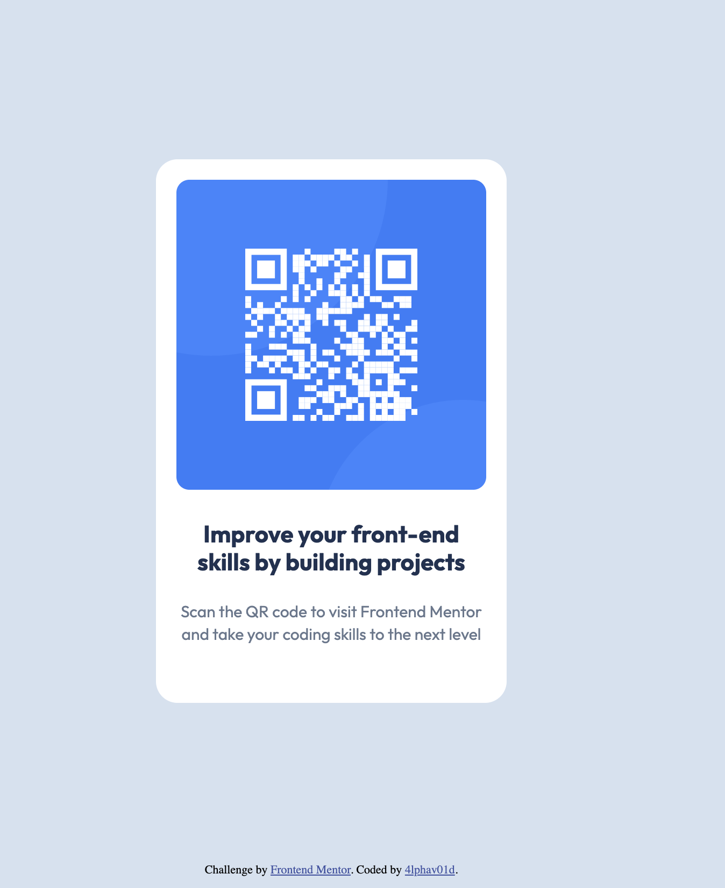

# Frontend Mentor - QR code component solution

This is a solution to the [QR code component challenge on Frontend Mentor](https://www.frontendmentor.io/challenges/qr-code-component-iux_sIO_H). Frontend Mentor challenges help you improve your coding skills by building realistic projects. 

## Table of contents

- [Overview](#overview)
  - [Screenshot](#screenshot)
  - [Links](#links)
- [My process](#my-process)
  - [Built with](#built-with)
  - [What I learned](#what-i-learned)
  - [Continued development](#continued-development)
  - [Useful resources](#useful-resources)
- [Author](#author)

## Overview

### Screenshot

### Links

- Solution URL: [Github Solution Url](https://github.com/4lphav01d/qr-code-component-main)
- Live Site URL: [View live site](https://4lphav01d.github.io/qr-code-component-main/)

## My process

### Built with

- Semantic HTML5 markup
- CSS custom properties
- Media-queries
- Mobile-first workflow

### What I learned

I relearned how to use media queries although, not very grounded but I have got the core idea behind the use of media queries. Will update my READMEs for subsequent problems that I will be working on. 

### Continued development

I want to focus on the flexbox and grid properties of css. Need to be intuitively understand them in order to master responsive layout. 

### Useful resources

- [web.dev css resource](https://web.dev/learn/css/) - It helped me as a refresher on selectors and specificity in css
- [deepseek](chat.deepseek.com) - Since I am very rusty in css at the moment, I prompted deepseek in order to get an explanation on how things worked the way they did for example, using Google fonts pulled off right from the Google Font Webpage.

## Author

- Frontend Mentor - [@4lphav01d](https://www.frontendmentor.io/profile/4lphav01d)
- Twitter - [@planarblob001](https://www.twitter.com/planarblob001)

